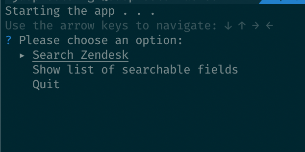
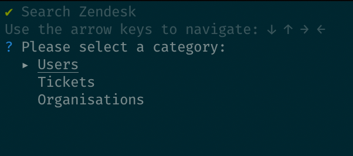
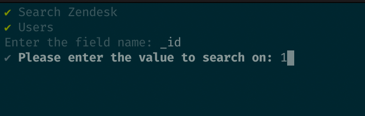

# Zendesk Search tool

[](https://github.com/tagpro/zd-search-cli/actions/workflows/build.yml)
[](https://github.com/tagpro/zd-search-cli/actions/workflows/lint.yml)

## Setup requirements

**Go 1.16** was the development setup for this application.
The easiest way to install go is using the official docs. Install golang by following the steps [here](https://golang.org/doc/install)
If you are on mac, you can run `brew install go` to install the latest version of golang.
If you are on Ubuntu, you can follow the steps here - https://github.com/golang/go/wiki/Ubuntu

**[gomock/mockgen](https://github.com/golang/mock)** is used in the repo to generate mocks to test for the interface created for different packages. 

**[golangci-lint](https://github.com/golangci/golangci-lint)** to do linting locally and in CI.

To install gomock, and golangci-lint run the following command 

```bash
make install-external
```

NOTE: `curl` is required to run the make command above

## Running the application locally

Run the following command to start the application in your local terminal.

```bash
make run
```

Or by using go directly 

```bash
go build -o ./bin/search ./cmd/search
./bin/search
```

Note: It should be able to build easily using default `go env` variables.

## Running linter locally

Run the following command to run linter locally after installing it

```bash
make lint
```

It requires `$GOPATH/bin` to be available inside the `$PATH` (official Go installer does this by default).

If you are on linux, setting the following in `~/.zshrc` or `~/.bashrc` or any other shell of your choosing and restarting the terminal should work 

```bash
export PATH="$PATH:$(go env GOPATH)/bin"
```

Alternatively, you can follow installations instructions [here](https://golangci-lint.run/usage/install/#local-installation) 

## Assumptions

- `_id` values are unique per record for all the users, tickets and, organisations.

## How to use the app

### To search the data, select the options displayed on the screen `Search Zendesk` and press enter.



### After selecting the option, choose the type of data you want to search



### After selecting the type, enter the details in the field



## Contribution

If you like to contribute, feel free to read the following to navigate the code

- The entrypoint of the application is `cmd/search` which has the main file.
- The main file at `cmd/search` starts the application by calling `pkg/cmd/search` which has the application logic defined. This is the first layer
  of the application. It is responsible to keep the application running. The logic to take user input is also defined
  in this layer
- The layer on top of `pkg/cmd/search` is called `pkg/serializer`. Serializer could be a misleading term to what it does.
  It has the connection to the data store. It takes the input from the `pkg/cmd/search` and uses that to fetch the data
  from the store. It also handles the logic to print the data on the screen.
- The layer on top of `pkg/serializer` is `pkg/store`, which is initialized by the app and sent to serializer for future
  use. `pkg/store` caches all the data from input files into memory to be fetched by the serializer quickly.
